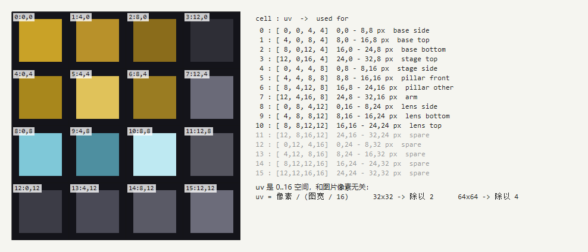

# 贴图怎么改（完整说明）

> 这份文档解决两件事：
> 1. **最省事地改现有贴图**（覆盖同名文件就行）；
> 2. **想让每个零件、甚至每个面各自一张图**时怎么做 —— 两条路都给了可以**直接复制开用**的完整示例。
>
> 相关：外形与碰撞箱见 `docs/MICROSCOPE.md`，本项目的贴图尺寸规则见 `docs/DESIGN.md` 第 5 节（R7：统一 32×32）。

---

## 0. 最短路径

**画好 32×32 的 PNG → 覆盖同名文件 → 游戏里按 F3+T。**

不用重启游戏，不用重新编译，不用跑 `runData`。改完文件切回游戏按 **F3+T**（重载资源包）就能看到。

> **`tools/make-placeholder-textures.ps1` 默认不会覆盖已经存在的文件**，只会补上缺的那几张，
> 所以你画好的图不会被它冲掉。真的要它重画才加 `-Force`：
>
> ```powershell
> pwsh -File tools/make-placeholder-textures.ps1            # 只补缺失的
> pwsh -File tools/make-placeholder-textures.ps1 -Force     # 全部重画（会覆盖你的图）
> ```

## 1. 现在有哪些贴图，各自贴在哪里

路径都相对于 `src/main/resources/assets/beyondtime/textures/`：

| 文件 | 尺寸 | 现在贴在 | 说明 |
|---|---|---|---|
| `block/microscope_base.png` | 32×32 | 底座 | **正式贴图** |
| `block/microscope_stage.png` | 32×32 | 载物台 | **正式贴图** |
| `block/microscope_pillar.png` | 32×32 | 立柱 | **正式贴图** |
| `block/microscope_arm.png` | 32×32 | 横臂 | **正式贴图** |
| `block/microscope_lens.png` | 32×32 | 镜筒 | **正式贴图**，可带透明 |
| `block/microscope.png` | 32×32 | —— | **旧版单贴图**，正式模型已经不用了 |
| `block/microscope_glass.png` | 32×32 | —— | **旧版单贴图**，同上 |
| `block/microscope_atlas.png` | 32×32 | —— | 只在"每个面单独画"那套里用，**现在没启用** |
| `item/petri_dish.png` | 32×32 | 培养皿物品 | 四角必须透明 |
| `microbe/<id>.png` | 32×32 | 显微镜界面里的菌种图标 | 界面里画成 16×16，共 12 张 |
| `gui/microscope.png` | **256×256** | 显微镜界面背景 | 可见面板 256×248，坐标表见 `docs/MICROSCOPE.md` 4.4 |

**注意事项**

- 文件名**全小写、下划线分隔、不能有中文**，和表里完全一致；
- 普通 PNG（8 位 RGBA），不要 JPG/WebP；
- 放在 `src/main/resources/`，**不要**放 `src/generated/`（那里是数据生成产出的，会被覆盖）；
- 32×32 是项目规则；技术上任何尺寸都能用，但换尺寸要同步改 uv 换算（见第 5 节）。

## 2. 不想开游戏也想看效果

四个预览脚本，都是 `pwsh -File tools/xxx.ps1`，输出到 `docs/img/`：

| 脚本 | 输出 | 用来看什么 |
|---|---|---|
| `preview-model.ps1` | `microscope-shapes.png` | 三个外形的正/侧/俯视，4 像素一格 |
| `preview-atlas.ps1` | `microscope-atlas.png` | 图集每一格对应的 uv 范围（第 5 节用） |
| `preview-gui.ps1` | `microscope-gui.png` | 界面每一块的像素坐标（画 GUI 背景用） |
| `preview-textures.ps1` | `microbe-icons.png` | 12 张菌种图标拼一起 |

## 3. 模型里的"贴图变量"是什么

现在 `models/block/microscope.json` 开头是这样：

```json
"textures": {
  "particle": "beyondtime:block/microscope",
  "body": "beyondtime:block/microscope",
  "glass": "beyondtime:block/microscope_glass"
}
```

下面每个零件写 `"texture": "#body"` 或 `"#glass"` 来引用。

> **`"texture"` 只能写变量名**（`#名字` 或直接写 `名字`），**不能直接写路径**。
> 写 `"texture": "beyondtime:block/xxx"` 是不行的，会变成缺失贴图（紫黑格子）。
> 想加一个新变量，先在 `textures` 块里登记，再去 faces 里引用。

## 4. 方案一：每个零件一张图（**推荐**）

**这条已经是正式的写法**（也是规则 R10）：5 个零件各用一张 32×32，互不干扰，仍然满足"统一 32×32"。

### 4.1 切换

正式模型已经就是这个方案，不需要再切换。如果以后被改回单贴图，用这条命令切回来：

```powershell
Copy-Item tools\microscope-variants\a_desk_per_part.json src\main\resources\assets\beyondtime\models\block\microscope.json
```

`a_desk_single.json` 是旧版单贴图模型，只在需要对照当年效果时才用（它引用
`microscope.png` / `microscope_glass.png`，所以那两张旧图一直留着没删）。

### 4.2 要画的 5 张图

| 文件 | 贴在 | 建议内容 |
|---|---|---|
| `block/microscope_base.png` | 底座 | 金属底板 + 四角螺丝 |
| `block/microscope_stage.png` | 载物台 | 深色台面，中间一圈圆孔（放培养皿的位置） |
| `block/microscope_pillar.png` | 立柱 | 黄铜立柱，正面画刻度 |
| `block/microscope_arm.png` | 横臂 | 横向的金属臂 |
| `block/microscope_lens.png` | 镜筒 | 玻璃筒身 + 镜片，可带透明 |

脚本已经把这 5 张占位图生成好了（`tools/make-placeholder-textures.ps1`），所以切过去**立刻就能跑**，
你只需要逐张替换。

### 4.3 完整文件

`models/block/microscope.json` 本身就是这一套，`tools/microscope-variants/a_desk_per_part.json`
是它的副本（两个文件内容完全一致，改完其中一个记得同步另一个）。

它的 `textures` 块只有六个名字：

```json
"textures": {
  "particle": "beyondtime:block/microscope_base",
  "base": "beyondtime:block/microscope_base",
  "stage": "beyondtime:block/microscope_stage",
  "pillar": "beyondtime:block/microscope_pillar",
  "arm": "beyondtime:block/microscope_arm",
  "lens": "beyondtime:block/microscope_lens"
}
```

五个零件各自引用一个变量，几何坐标和单贴图那版**一模一样**，只有贴图来源变了。

## 5. 方案二：每个面单独画（一张图集 + uv）

如果连"底座顶面"和"底座侧面"都想画成不一样的图，就用 `uv` 从一张图里切不同的小块。
一个方块 5 个零件 × 6 个面 = 30 个面，**不**建议一个面存一张 PNG（文件太多、也不好维护），
标准做法是**一张图集 + 每个面写 uv**。

### 5.1 uv 的坐标空间：永远是 0..16

> **uv 和图片像素无关，永远在 0..16 的坐标空间里。**

换算公式：

```
uv = 像素坐标 ÷ (图片宽度 ÷ 16)
```

| 图片尺寸 | 每 1 个 uv = 多少像素 | 换算 |
|---|---|---|
| **32×32** | 2 像素 | uv = 像素 ÷ 2 |
| 64×64 | 4 像素 | uv = 像素 ÷ 4 |
| 128×128 | 8 像素 | uv = 像素 ÷ 8 |

例：32×32 图上 `(8, 0)` 到 `(16, 8)` 这一块 → 写成 `"uv": [4, 0, 8, 4]`。

### 5.2 uv 怎么写

```json
"north": { "texture": "#atlas", "uv": [minU, minV, maxU, maxV] }
```

- 四个数字是**左上角**和**右下角**；
- `u` 向右增大，`v` **向下**增大（和图片的坐标系一致）；
- 不写 `uv` 时游戏会自己算（见第 7 节）。

### 5.3 32×32 切成 4×4 个 8×8 的格子

这是示例图集 `block/microscope_atlas.png` 的切法，`docs/img/microscope-atlas.png` 是把这张图放大
并标好 uv 的对照图（`pwsh -File tools/preview-atlas.ps1` 重新生成）：



| 格 | uv | 像素范围 | 示例里用在哪 |
|---|---|---|---|
| 0 | `[0, 0, 4, 4]` | 0,0 – 8,8 | 底座 侧面 |
| 1 | `[4, 0, 8, 4]` | 8,0 – 16,8 | 底座 顶面 |
| 2 | `[8, 0, 12, 4]` | 16,0 – 24,8 | 底座 底面 |
| 3 | `[12, 0, 16, 4]` | 24,0 – 32,8 | 载物台 顶面（放培养皿） |
| 4 | `[0, 4, 4, 8]` | 0,8 – 8,16 | 载物台 侧面 |
| 5 | `[4, 4, 8, 8]` | 8,8 – 16,16 | 立柱 正面（刻度） |
| 6 | `[8, 4, 12, 8]` | 16,8 – 24,16 | 立柱 其它面 |
| 7 | `[12, 4, 16, 8]` | 24,8 – 32,16 | 横臂 |
| 8 | `[0, 8, 4, 12]` | 0,16 – 8,24 | 镜筒 侧面 |
| 9 | `[4, 8, 8, 12]` | 8,16 – 16,24 | 镜筒 底面（物镜） |
| 10 | `[8, 8, 12, 12]` | 16,16 – 24,24 | 镜筒 顶面（目镜） |
| 11 | `[12, 8, 16, 12]` | 24,16 – 32,24 | 备用 |
| 12–15 | 第四行 | 下半张图 | 备用 |

### 5.4 切换

```powershell
Copy-Item tools\microscope-variants\a_desk_per_face.json src\main\resources\assets\beyondtime\models\block\microscope.json
```

要画的只有一张：`block/microscope_atlas.png`（32×32）。完整模型在
`tools/microscope-variants/a_desk_per_face.json`。

### 5.5 `rotation`：在图块里转 90°

```json
"west": { "texture": "#atlas", "uv": [8, 4, 12, 8], "rotation": 90 }
```

取值 `0` / `90` / `180` / `270`，**只在那个面内部旋转**，不影响别人。
示例里立柱的东西两个侧面用了 `90`，让同一个格子里的横向刻度在侧面变成竖向。

### 5.6 哪个面的 u 朝哪边（免得画反）

面的 u/v 方向是固定的，`uv` 只决定取图上的哪一块。下表由游戏源码
`FaceBakery.defaultFaceUV` 推出：

| 面 | u（横向）沿 | v（纵向）沿 | 看图的直觉 |
|---|---|---|---|
| `up` 顶面 | **+x**（西→东） | **+z**（北→南） | 图片上方 = 北边 |
| `down` 底面 | **+x**（西→东） | **−z**（南→北） | 图片上方 = 南边（从下往上看） |
| `north` 北面 | **−x**（东→西） | **−y**（下→上） | 从北往南看，图片左右和历史直觉相反 |
| `south` 南面 | **+x**（西→东） | **−y**（下→上） | 从南往北看，正常 |
| `west` 西面 | **+z**（北→南） | **−y**（下→上） | 从西往东看 |
| `east` 东面 | **−z**（南→北） | **−y**（下→上） | 从东往西看 |

如果某个面画上去**左右反了**，把 `uv` 的前两个数和后两个数对调（`[a,b,c,d]` → `[c,b,a,d]`）
就行；**上下反了**就 `[a,b,c,d]` → `[a,d,c,b]`。当然也可以直接改画稿。

## 6. 方案三：每个面一张 PNG（**不推荐**）

给 30 个面各起一个变量名、各存一个文件，技术上完全可行：

```json
"textures": {
  "base_up": "beyondtime:block/microscope_base_up",
  "base_north": "beyondtime:block/microscope_base_north",
  ...
},
"elements": [
  { "from": [1,0,1], "to": [15,3,15],
    "faces": { "up": { "texture": "#base_up" }, "north": { "texture": "#base_north" }, ... } }
]
```

但 30 个文件要管、改一个外形要动一堆图，**方案二能覆盖同样的效果而且只有一张图**。
除非你想要每个面都是完整的 32×32 细节，否则不建议。

## 7. 不写 uv 的时候，游戏自己会怎么算（重要）

**没写 `uv` 的面，游戏会拿这个 box 的 `from`/`to` 投影到 0..16 里当 uv**，不是"整张贴满"：

| 面 | 自动 uv |
|---|---|
| `down` | `from.x, 16-to.z, to.x, 16-from.z` |
| `up` | `from.x, from.z, to.x, to.z` |
| `north` | `16-to.x, 16-to.y, 16-from.x, 16-from.y` |
| `south` | `from.x, 16-to.y, to.x, 16-from.y` |
| `west` | `from.z, 16-to.y, to.z, 16-from.y` |
| `east` | `16-to.z, 16-to.y, 16-from.z, 16-from.y` |

**这就是现在显微镜的情况。**举两个实际数字（`microscope.png` 是 32×32，1 uv = 2 像素）：

| 零件 / 面 | 自动 uv | 实际取到的像素 |
|---|---|---|
| 底座 `[1,0,1]`→`[15,3,15]` 的**顶面** | `1,1,15,15` | `(2,2)` – `(30,30)` |
| 底座 的**北面** | `1,13,15,16` | `(2,26)` – `(30,32)` |
| 载物台 `[3,5,3]`→`[11,6,13]` 的**顶面** | `3,3,11,13` | `(6,6)` – `(22,26)` |
| 镜筒 `[6,9,6]`→`[8,16,8]` 的**北面** | `8,0,10,7` | `(16,0)` – `(20,14)` |

含义：

- 只有**刚好占满整格**（`from` 0 / `to` 16）的 box，才会"整张贴满"；
- 显微镜的零件都比一格小，所以**每个面取的都是图上对应位置的一小块**；
- 如果某个面你希望**精确地铺满整张图**，显式写 `"uv": [0, 0, 16, 16]` 就行。

> 这条以前在 `docs/MICROSCOPE.md` 里写错过（写成"一个面 = 整张贴图铺满一次"），已改。

## 8. 出问题了怎么查

| 现象 | 原因 | 解决 |
|---|---|---|
| 紫黑格子 | 变量名写错，或 PNG 文件不存在 | 检查 `textures` 块的名字与文件名、大小写 |
| 整个模型变成紫黑方块 | `models/block/microscope.json` 的 JSON 语法坏了 | 用编辑器格式化一下，或 `Get-Content ... \| ConvertFrom-Json` 验一下 |
| 改完没反应 | 没按 F3+T，或文件放错目录（放进了 `src/generated`） | 文件必须在 `src/main/resources/assets/beyondtime/textures/` |
| 贴图被拉伸/糊 | 一个非正方形的面塞进了正方形图块 | 用 `uv` 取正确的长宽比，或按第 5.6 节调方向 |
| 左右/上下反了 | u/v 方向 | 见第 5.6 节的调换方法 |
| 物品栏/手里的图标不对 | 物品图标**就是**这个方块模型（`items/microscope.json` 指向 `block/microscope`） | 改模型就等于改图标，不用另外画物品图 |
| 破坏时的粒子不对 | 粒子用 `textures` 里的 `particle` 变量 | 改那个变量指向的贴图 |

## 9. 相关文件位置

| 东西 | 位置 |
|---|---|
| 方块模型（手写） | `src/main/resources/assets/beyondtime/models/block/microscope.json` |
| 物品定义（指向方块模型） | `src/generated/resources/assets/beyondtime/items/microscope.json` |
| blockstate（datagen 生成，四个朝向） | `src/generated/resources/assets/beyondtime/blockstates/microscope.json` |
| 可切换的模型变体 | `tools/microscope-variants/`（`a_desk_per_part` 当前 / `a_desk_single` 旧版单贴图 / `a_desk_per_face` 图集版 / `b_tower` / `c_low_bench`） |
| 占位贴图生成 | `tools/make-placeholder-textures.ps1` |
| 四个预览脚本 | `tools/preview-model.ps1` / `preview-atlas.ps1` / `preview-gui.ps1` / `preview-textures.ps1` |

## 10. 新方块的约定（规则 R10）

**从显微镜之后开始，所有新方块都按这个来：**

| 方块形状 | 怎么拆 | 贴图命名 |
|---|---|---|
| **完整方块**（占满一格） | 按**面**拆，六个面各一张 | `<方块名>_up` / `_down` / `_north` / `_south` / `_west` / `_east` |
| **非完整方块**（机器、台面等） | 按**零件**拆，每个能看出形状的部件一张 | `<方块名>_<零件名>`，零件名自己定（如 `_base` / `_stage` / `_pillar`） |

**不允许**一个方块只有一张贴图铺满所有面。就算两个面画得完全一样，也要**两个变量**——
这样以后想单独改其中一个面，不用动模型结构。

### 10.1 起手：跑脚手架

```powershell
# 完整方块：生成 6 张面贴图 + 一个六面都接好的模型 JSON
pwsh -File tools/new-block.ps1 -Block copper_centrifuge

# 非完整方块：只生成零件贴图（几何要手写），并打印可粘贴的 textures 片段
pwsh -File tools/new-block.ps1 -Block cloning_vat -Units base,tank,panel,pipe
```

脚本**默认不覆盖已存在的文件**，要重画加 `-Force`。生成的东西：

```
src/main/resources/assets/beyondtime/textures/block/<方块名>_*.png   32×32 占位图
src/main/resources/assets/beyondtime/models/block/<方块名>.json      只有完整方块会生成
```

占位图每张颜色不同、左上角有 N 个小点（第几张），这样在游戏里一眼能看出哪个面是哪张。

### 10.2 完整方块的模型长这样

```json
{
  "parent": "minecraft:block/block",
  "textures": {
    "particle": "beyondtime:block/copper_centrifuge_up",
    "up":    "beyondtime:block/copper_centrifuge_up",
    "down":  "beyondtime:block/copper_centrifuge_down",
    "north": "beyondtime:block/copper_centrifuge_north",
    "south": "beyondtime:block/copper_centrifuge_south",
    "west":  "beyondtime:block/copper_centrifuge_west",
    "east":  "beyondtime:block/copper_centrifuge_east"
  },
  "elements": [
    {
      "from": [0, 0, 0],
      "to": [16, 16, 16],
      "faces": {
        "up":    { "texture": "#up",    "cullface": "up" },
        "down":  { "texture": "#down",  "cullface": "down" },
        "north": { "texture": "#north", "cullface": "north" },
        "south": { "texture": "#south", "cullface": "south" },
        "west":  { "texture": "#west",  "cullface": "west" },
        "east":  { "texture": "#east",  "cullface": "east" }
      }
    }
  ]
}
```

要点：

- 一个 `element` 就够，六面齐全 + 每面 `cullface` 才是"完整方块"（贴邻居的那一面不渲染）；
- `from` 0 / `to` 16 时自动 uv 正好是整张贴图，不用写 `uv`；
- `minecraft:block/block` 这个 parent 提供手持/物品栏的显示变换，别去掉。

### 10.3 非完整方块的模型

几何要手写（参考 `models/block/microscope.json`），但规矩一样：**每个部件至少一个变量**，
部件内部如果某个面要单独画，就照第 5 节写 `uv`。

### 10.4 完整流程

1. `pwsh -File tools/new-block.ps1 -Block <名字>`（或 `-Units a,b,c`）
2. 在 `BTBlocks.java` 里注册方块
3. 在 `BTModelProvider.java` 里加 blockstate 的 datagen
4. 完整方块一般还要加 `BlockItem` 和 `items/<名字>.json` 的 datagen
5. `.\gradlew.bat runData` → `tools\dev-client.bat` 里看效果
6. 逐张替换 `<方块名>_*.png`
